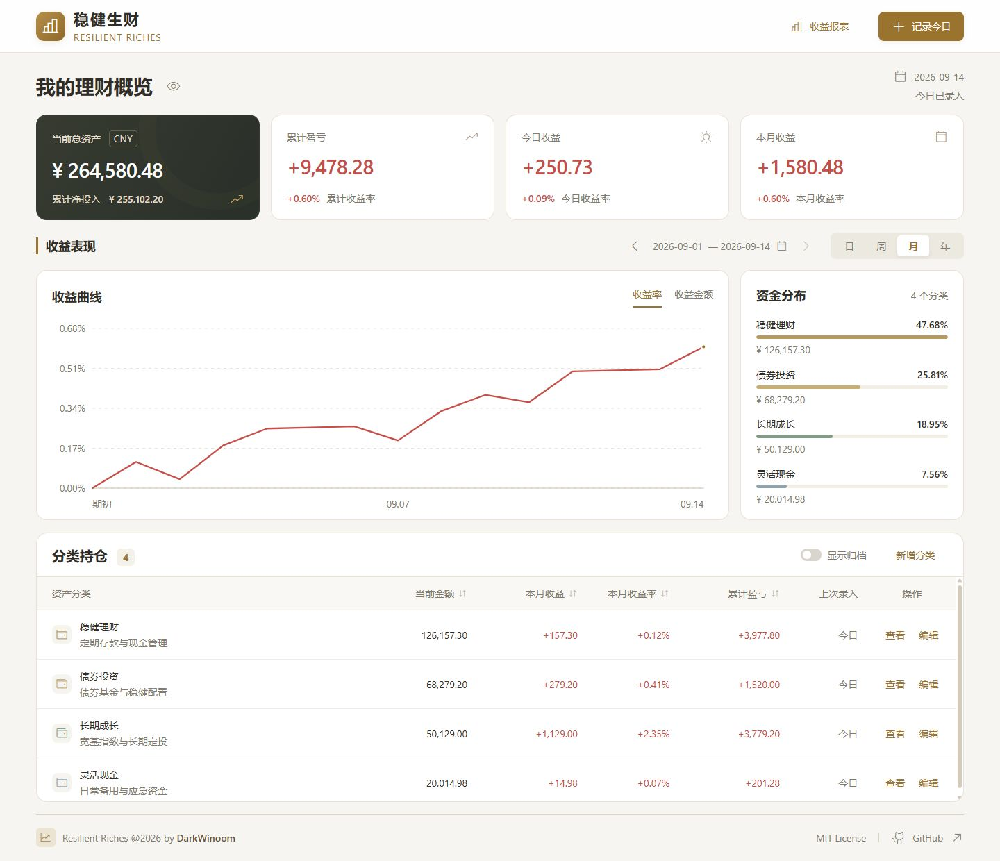
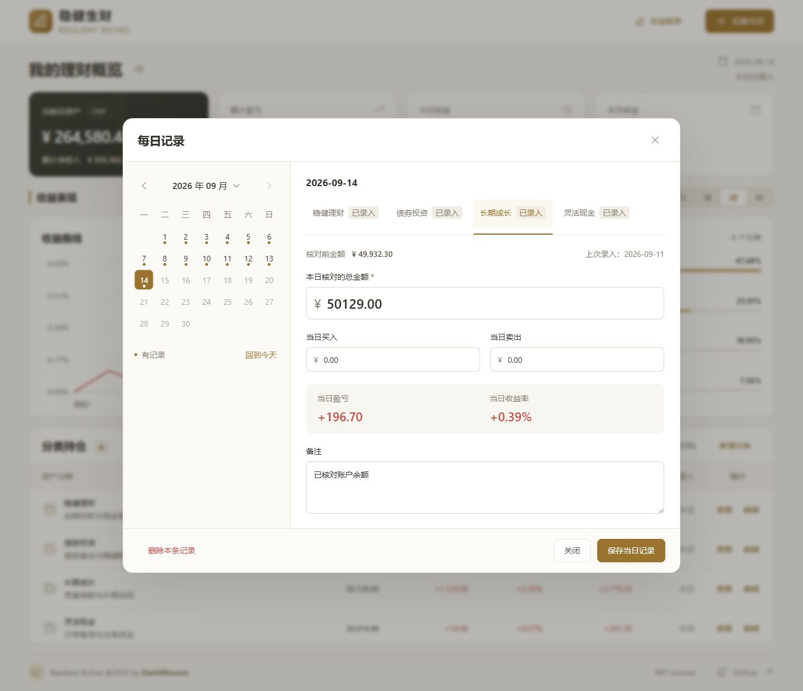
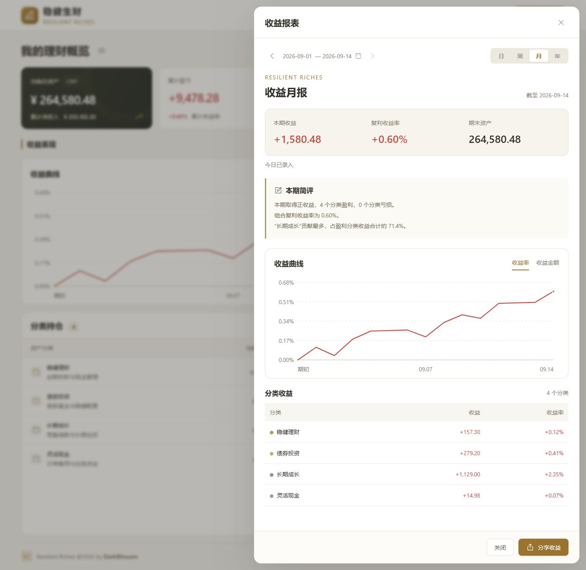

# 稳健生财 · Resilient Riches

用自己的分类，记清理财余额与收益。

将资金按“稳健理财”“债券投资”“长期成长”等分类管理，核对余额、记录买入卖出，即可查看收益变化。无需逐个维护具体理财产品，也不必每天录入。

- **一页看清资金**：总资产、累计盈亏、今日与本月收益，以及收益曲线、资金分布、分类持仓。
- **按自己的节奏记录**：日历补录、修改历史数据；未录入的日期自动沿用上次余额。
- **收益自动计算**：扣除买入卖出的影响，按每日收益率连乘计算期间复利收益率。
- **方便回顾与分享**：日／周／月／年报表、本期简评、PNG 图片，可隐藏金额和分类。
- **账本由自己保管**：单人私有部署，无登录；SQLite 存储，支持备份恢复，代码采用 [MIT 许可](LICENSE)。

[部署应用](#docker-部署推荐) · [开始记账](#开始记账) · [报表与分享](#报表与分享图片) · [备份与恢复](#备份账本) · [常见问题](#常见问题)



本页截图使用独立演示账本中的模拟数据，包含收益波动、定投和资金转出。首次部署会得到空账本。

## Docker 部署（推荐）

安装 Docker Desktop 或 Docker Engine + Compose 后，在终端运行：

```sh
git clone https://github.com/DarkWinoom/resilient-riches.git
cd resilient-riches
docker compose up -d --build
```

打开 [本地应用](http://127.0.0.1:8888)。首次启动自动初始化空账本；镜像使用 Node 22，容器以非 root 用户运行。Docker 启动后应用自动重启，手动停止后保持停止状态。

```sh
docker compose ps          # 查看运行及健康状态
docker compose logs -f app # 查看日志，Ctrl+C只退出日志查看
docker compose stop       # 停止应用
docker compose up -d       # 再次启动
```

数据库位于命名卷 `ledger-data` 中，容器重建或执行 `docker compose down` 后仍保留。**不要使用 `docker compose down -v`，它会删除数据卷。** 默认卷名带有项目目录前缀，迁移目录时保持同一个 Compose 项目名，或先备份再恢复。

如端口 8888 已占用，将 `.env.example` 复制为 `.env`，把 `RR_PORT` 改为其他端口后重新启动即可。已有 `.env` 的部署以其中的 `RR_PORT` 为准。

## 开始记账

1. 点击“分类持仓”右上角的“新增分类”，填写名称、配色、启用日期和初始资金。初始资金填写启用当天实际持有的金额，启用前的盈亏单独填写在“历史盈亏”中。
2. 点击顶部“记录今日”，或点击分类行的“查看”后选择“记录今日”。详情中的入口会直接选中今天和该分类，已有记录会自动填入。
3. 在左侧日历选择日期，右侧切换分类，填写核对总金额、当日买入和卖出。表单即时显示收益预览；点击“保存当日记录”保存当前日期所有修改过的分类。

未录入日期会自动沿用上次余额，无需每天记账。日历圆点只表示该日已有记录，各分类的上次录入时间也会显示在持仓表中。点击日历月份可直接选择年份与月份，方便补录较早的数据。

同一天切换分类时，未保存内容暂存在本次窗口中。切换日期或关闭窗口前，若有未保存内容，会提示确认放弃；也可取消并先保存。保存成功后窗口自动关闭，首页同步更新。关闭浏览器或刷新页面不会保留草稿。

金额输入实时拦截字母、多余小数位和超出上限的数值，并在输入框下提示原因。金额最多两位小数；只有历史盈亏允许负数。修正输入后即可提交。

修改历史记录会重新计算后续收益。若改动导致后续卖出超过可用资金，整次保存会被拒绝，原记录保持不变。若另一个页面已经修改同一分类，系统会提示重新载入，避免覆盖新数据。

<details>
<summary>查看每日记录界面</summary>



</details>

## 整理分类与记录

- 点击分类行的“编辑”修改该分类信息；余额为零时可以归档，归档后历史记录仍保留，也可以恢复使用。新增、修改、归档、恢复或删除成功后，窗口自动关闭并刷新首页。
- 持仓表默认隐藏归档分类，可打开“显示归档”。补改归档分类的历史记录时，在记录窗口选择归档当天或更早的有效日期。
- 删除分类前会显示受影响的记录数量与日期范围；删除分类会同时删除其全部记录。删除单日记录也需要确认。
- 分类间转移资金时，在来源分类填写卖出，在目标分类填写买入，可在同一天一起保存。

## 查看收益

首页顶部固定展示当前资产、累计盈亏、今日收益和本月收益。下方的日／周／月／年切换只影响收益曲线与分类期间收益，查看历史期间时，顶部摘要和资金分布仍然表示当前情况。

点击期间日期可打开中文日历，按当前日／周／月／年模式直接点选对应期间，无需手填日期；也可以使用左右箭头切换期间。月份四行完整展示，年份按每页12年翻页选择。周模式以周一为起始，不能选择未来期间。曲线支持收益金额和复利收益率两种显示，鼠标移动或聚焦图表后使用左右方向键查看每日数据；本金归零后重新投入等无法连续复利的情况不会绘制虚假的连续收益率。

灰色禁用操作会在悬停或点击时说明原因，例如需先新增分类、正在保存、分类已归档或日期超出范围。

资金分布显示全部有余额的分类，百分比以总资产为分母，条形长度按最大分类缩放。分类较多时可在分布区内滚动。点击持仓表头可以切换降序、升序和原始分类顺序，手机使用列表上方的排序按钮。

点击分类名称或行右侧的“查看”，查看该分类在所选期间的明细和真实记录；点击“修改记录”可进入对应历史日期。“上次录入”列今天显示“今日”，本年显示月日，跨年显示完整年月日。

标题旁的眼睛按钮可以隐藏页面金额，只保留收益率与占比。打开分享窗口时会沿用此金额显示偏好，也可以在分享预览中单独调整。

## 报表与分享图片

点击“收益报表”查看日报、周报、月报或年报，也可以切换历史期间。报表使用所选期间的期末资产与收益，当前尚未结束的期间显示“截至”日期。简评根据实际记录描述盈利、亏损和主要贡献分类，不包含市场排名或行情预测。

点击“分享收益”，确认图片预览后选择“保存 PNG”。图片在本机浏览器中生成，不上传；生成后可在浏览器的下载列表或默认下载目录中找到。较长图片可切换“原尺寸预览”检查细节。

所选期间没有实际录入记录时，分享暂不可用；已录入但收益为零的记录仍可分享。分享图只展示期间收益、收益率、收益曲线与分类收益，不包含期末资产。日报分享不显示收益曲线。

- **隐藏金额**：图片只显示收益率，不包含余额、收益金额或金额坐标。
- **隐藏分类**：图片只保留组合总览和总收益率曲线，不包含分类名称、颜色和数量。
- 两个选项可以同时开启。备注和收益简评始终不进入分享图片。

分类较多时会生成包含全部分类的长图；如果浏览器无法生成过大的图片，可以选择隐藏分类后重试。报表与分享窗口可直接关闭，切换筛选和隐私选项不会触发放弃保存确认。

<details>
<summary>查看收益月报界面</summary>



</details>

## 备份账本

备份命令使用 SQLite 在线快照，服务运行时也可执行，包含已提交的 WAL 数据，得到可单独保存的 `.sqlite` 文件。**每次使用不同的文件名**，命令不会覆盖已有备份。

Docker：

```sh
docker compose exec app node apps/server/dist/backup.js data/backups/manual-1.sqlite
docker compose cp app:/app/data/backups/manual-1.sqlite ./ledger-backup.sqlite
```

第二步将备份保存到当前电脑，可另存至其他磁盘。只保存在数据卷中的备份不能防止整个数据卷丢失。

Node.js 直接部署（先完成构建）：

```sh
pnpm db:backup backups/manual-1.sqlite
```

## 恢复账本

恢复会覆盖整个账本。命令默认只校验备份并显示来源、目标和记录数量；确认无误后加 `--confirm` 才执行。恢复前必须停止应用，工具会在数据目录的 `backups/` 中保留覆盖前的原文件；损坏的原文件也会被保留。

Docker 恢复保存在数据卷中的备份：

```sh
docker compose stop app
docker compose run --rm --no-deps app node apps/server/dist/restore.js data/backups/manual-1.sqlite
docker compose run --rm --no-deps app node apps/server/dist/restore.js data/backups/manual-1.sqlite --confirm
docker compose up -d
```

若备份在当前电脑，先创建过应用容器，再将文件复制到数据卷并赋予应用用户访问权限：

```sh
docker compose stop app
docker compose cp ./ledger-backup.sqlite app:/app/data/restore-input.sqlite
docker compose run --rm --no-deps --user root app chown node:node /app/data/restore-input.sqlite
docker compose run --rm --no-deps app node apps/server/dist/restore.js data/restore-input.sqlite
docker compose run --rm --no-deps app node apps/server/dist/restore.js data/restore-input.sqlite --confirm
docker compose up -d
```

Node.js 直接部署：先在运行应用的终端按 `Ctrl+C`，或停止对应的进程服务，然后运行：

```sh
pnpm db:restore backups/manual-1.sqlite
pnpm db:restore backups/manual-1.sqlite --confirm
pnpm start
```

完整性、外键、迁移历史、业务设置或资金记录校验不通过时，恢复会被拒绝，原账本保持不变。恢复其他版本的数据时，先使用与备份兼容或更新的应用版本；不要用旧版本覆盖更新的数据库。

## 升级

先按上文生成并保存备份，再更新代码：

```sh
git pull --ff-only
docker compose up -d --build
```

直接部署则先停止服务，运行 `git pull --ff-only`、`pnpm install --frozen-lockfile`、`pnpm build`，再 `pnpm start`。启动会自动应用数据库迁移。回退代码前应确认数据库兼容；需要回退数据时恢复升级前备份，而不是直接运行旧版本。

## Node.js 直接部署

需要 **Node.js 22.22.2 或更新的 Node 22 版本**、**pnpm 11.19.0**。项目统一使用 Node 22。

```sh
git clone https://github.com/DarkWinoom/resilient-riches.git
cd resilient-riches
pnpm install --frozen-lockfile
pnpm build
pnpm start
```

未设置环境变量时，浏览器打开 [本地应用](http://127.0.0.1:8080)。若已复制项目的 `.env.example`，则使用其中的端口，默认为 [8888](http://127.0.0.1:8888)。首次启动会自动创建数据库并应用迁移，后续启动保留数据。

如未安装 pnpm，可在安装 Node.js 后运行 `npm install -g pnpm@11.19.0`。

## 数据与配置

Node.js 直接部署的数据库默认保存为项目目录下的 `data/resilient-riches.sqlite`；Docker 使用独立的数据卷，两者不会自动共享账本。要迁移已有数据，请使用下方备份和恢复步骤。SQLite 的关联文件也由数据目录保存，不要在服务运行时单独移动或复制主数据库文件。

需要改端口或数据位置时，将 `.env.example` 复制为 `.env` 后修改：

| 变量               | 默认值                                             | 用途                                                          |
| ------------------ | -------------------------------------------------- | ------------------------------------------------------------- |
| `RR_HOST`          | `127.0.0.1`                                        | 监听地址，默认仅本机可访问                                    |
| `RR_PORT`          | Docker及示例配置：`8888`；直接运行未配置时：`8080` | 后端和生产页面端口                                            |
| `RR_DATABASE_PATH` | `./data/resilient-riches.sqlite`                   | 数据库路径，相对路径以项目根目录为准                          |
| `RR_BIND_ADDRESS`  | `127.0.0.1`                                        | Docker 映射到主机的监听地址                                   |
| `RR_PUBLIC_ORIGIN` | 空                                                 | HTTPS反向代理时填写完整站点源，如`https://ledger.example.com` |

Docker 固定在容器内监听 `0.0.0.0:8080`，数据位置为 `/app/data/resilient-riches.sqlite`；通过 `RR_BIND_ADDRESS` 和 `RR_PORT` 控制主机访问入口。`RR_HOST` 和 `RR_DATABASE_PATH` 用于 Node.js 直接部署。

如需在局域网访问，可自行调整监听地址。应用不提供登录，也不区分多个用户，能够访问服务的人可以读写账本；远程部署的入口访问控制由部署者配置。

Node.js 22 启动时可能输出 SQLite 的 `ExperimentalWarning`，这是运行时提示；若随后显示服务已启动，且页面可以访问，就可正常使用。

HTTPS 反向代理应转发到应用端口并保留原始 Host，同时设置 `RR_PUBLIC_ORIGIN` 为浏览器访问的源地址（协议、域名及可选端口，不带路径）。配置后，浏览器写请求只接受这个源；不配置时按应用自身的协议和 Host 检查。应用不支持挂在站点子路径下。

## 常见问题

- **页面打不开或容器不健康**：先看 `docker compose ps` 和 `docker compose logs app`，确认端口未占用、数据卷可写。直接部署用 `pnpm start` 查看错误输出。
- **新建或修改被拒绝，提示来源不正确**：HTTPS 代理检查 `RR_PUBLIC_ORIGIN`，不要填写路径；修改配置后重新启动容器或 Node 进程。
- **换目录后变成空账本**：Docker 默认项目名随目录名变化。回到原目录／原项目名启动，或将原卷账本备份后恢复到新项目；不要删除原卷。
- **恢复提示存在运行关联文件**：停止所有使用同一账本的进程。异常退出后可先正常启动并关闭一次；如果仍无法启动，先完整保留原数据目录，再将备份恢复到新的空数据库路径，不要直接删除 WAL 文件。
- **备份提示文件已存在**：换一个文件名，旧备份会被保留。
- **没有登录页面**：这是单人私有部署工具，能够访问应用的人可以读写账本。推荐本机、NAS 或家庭服务器部署，远程访问由部署者管理入口权限。

项目不限制部署方式。GitHub CI 会在 Node 22 下运行检查和 Docker 构建，不自动上传账本、发布镜像或创建 Release。

## 收益如何记录

需要更新时，选择日期并填写核对余额、买入和卖出金额。按照日初净投入约定：

```text
当日收益 = 当日余额 − 上次余额 − 当日买入 + 当日卖出
当日收益率 = 当日收益 ÷（上次余额 + 当日买入 − 当日卖出）
期间复利收益率 = ∏（1 + 每日收益率）− 1
```

未录入的日期自动沿用上一日金额，按无收益变动、无资金进出处理；再次录入时，扣除买入和卖出后的余额差额计入本次录入日期。周末、节假日或其他不需要更新的日期都不必额外标记，有资金进出时可在对应日期录入。

历史盈亏计入累计盈亏金额；没有历史资金和日期明细时，不据此推算历史复利收益率。

计算内核以整数分和高精度十进制运算处理金额与复利。单项金额上限为 999,999,999,999.99 元。零本金收益、资金亏光后重新投入等无法直接连乘的情况会返回明确状态，不显示无效数字；首版不使用这些数据自动推算年化收益率。

## 开发与检查

```sh
pnpm dev
```

开发页面默认位于 [localhost:5173](http://127.0.0.1:5173)，通过代理连接后端。`.env` 中的后端端口会用于开发代理。

```sh
pnpm check       # lint、格式、类型、测试和构建
pnpm test        # 财务计算、数据库、API 和界面联动测试
pnpm db:migrate  # 单独执行数据库迁移，需先完成构建
pnpm db:backup backups/example.sqlite  # 在线快照，文件名不能已存在
pnpm db:restore backups/example.sqlite # 仅校验和预览，停机确认后加--confirm
```

| 目录            | 内容                           |
| --------------- | ------------------------------ |
| `apps/web`      | Vue 3 前端                     |
| `apps/server`   | Fastify 服务、SQLite 和迁移    |
| `packages/core` | 共享金额、日期、复利与账本计算 |

## 开源许可

项目采用 [MIT License](LICENSE)，允许使用、修改、分发和商业使用，分发时请保留版权声明及许可文本。

第三方依赖保留各自许可证。浏览器构建中保留 Vue、Vite 预加载运行时、decimal.js、Vue Datepicker 及其依赖的版权与 MIT 文本；本地 Phosphor Light 字体图标也保留原许可。详情见 [前端第三方声明](apps/web/public/third-party-notices.txt)。
