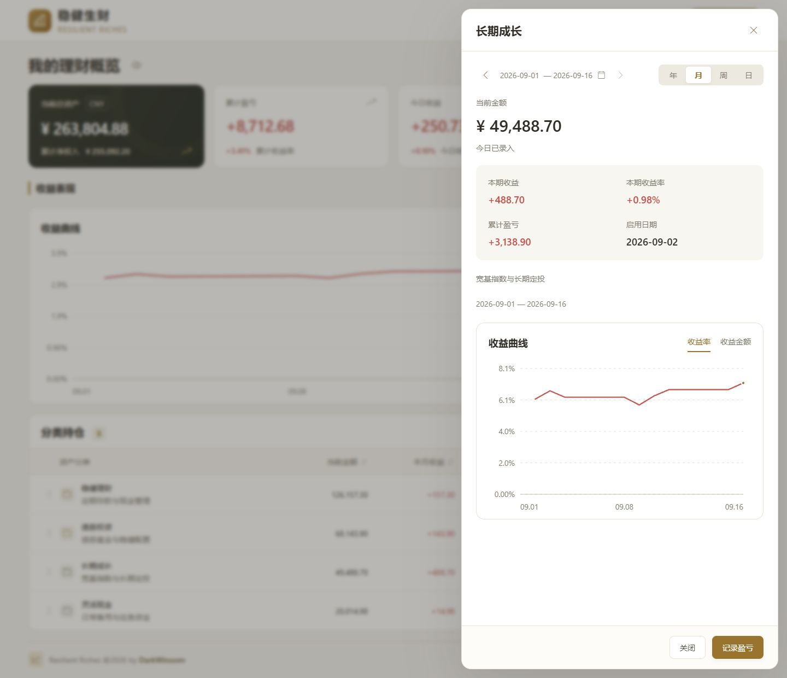

# 稳健生财

个人理财记账小应用，可自定义分类进行全面整合统计，支持按天录入。数据均保存在本地，一键部署，简单易用


## 部署

推荐在本机、NAS 或家庭服务器上使用 Docker Desktop / Docker Engine + Compose：

```sh
git clone https://github.com/DarkWinoom/resilient-riches.git
cd resilient-riches
docker compose up -d --build
```

打开 **[http://127.0.0.1:8888](http://127.0.0.1:8888)** 即可开始。端口被占用时，复制 `.env.example` 为 `.env`，修改 `RR_PORT` 后重新启动。

| 操作            | 命令                                           |
| --------------- | ---------------------------------------------- |
| 查看运行状态    | `docker compose ps`                            |
| 查看日志        | `docker compose logs -f app`                   |
| 停止 / 再次启动 | `docker compose stop` / `docker compose up -d` |

应用没有登录和多用户功能，能访问页面的人都能读写账本。默认仅本机可访问；部署到公网时，请自行设置入口访问控制。

<details>
<summary>不用 Docker：Node.js 直接部署</summary>

准备 Node.js **22.22.2 或更新的 Node 22** 与 pnpm **11.19.0**，进入项目目录后执行：

```sh
pnpm install --frozen-lockfile
pnpm build
pnpm start
```

未配置端口时访问 [8080](http://127.0.0.1:8080)；复制 `.env.example` 后默认使用 [8888](http://127.0.0.1:8888)。数据库默认在 `data/resilient-riches.sqlite`。启动时的 SQLite `ExperimentalWarning` 是 Node 22 的运行时提示。

</details>

## 开始记账

| 第一步：新增分类                                                       | 第二步：记录盈亏                                         | 第三步：查看变化                                                     |
| ---------------------------------------------------------------------- | -------------------------------------------------------- | -------------------------------------------------------------------- |
| 在“分类持仓”点“新增分类”，用日历选择启用日期，填入初始金额和历史盈亏。 | 点“记录盈亏”，选择日期与分类，填写核对余额、买入、卖出。 | 保存后首页自动更新；行内“查看”展示分类收益曲线，“编辑”修改分类信息。 |


- 日历 **无点＝未录入，单点＝部分分类已录，双点＝当天全部可录入分类已录**。这是记录状态，不是每天必须完成的任务。
- 未录入日期沿用上次余额；周末或没有变动时可以跳过。再次核对的余额差额计入本次日期。
- 金额清空会归零，最多两位小数；历史盈亏可填负数。非法金额会立即提示并阻止输入。
- 同一天可切换分类一起保存；有未保存内容时，换日期或关闭窗口会先确认。保存后自动关闭并提示成功；删除单条记录后窗口继续保留。

分类之间转账时，分别填写来源分类的卖出、目标分类的买入。历史记录可通过日历补录或修改；修改会重新计算后续收益。

<details>
<summary>分类详情与管理</summary>



分类详情按首页所选期间展示，日视图不显示曲线。余额为零的分类可在“编辑”中归档；打开“显示归档”可恢复使用。删除分类会同时删除它的全部记录，操作前会显示影响范围并再次确认。

</details>

## 报表与分享

首页四张卡片固定展示当前资产、累计盈亏、今日收益和本月收益；下面的日／周／月／年只切换期间曲线与分类收益。点击日期可通过日历查看其他期间。


在“收益报表”中点“分享收益”，选择隐私选项后保存 PNG，图片由本机浏览器生成。

| 分享选项 | 图片内容                         |
| -------- | -------------------------------- |
| 默认     | 周期收益、收益率、曲线、分类收益 |
| 隐藏金额 | 只展示收益率，不显示实际资金体量 |
| 隐藏分类 | 只保留总览；可同时隐藏金额       |

日报分享不显示曲线；所选期间没有实际记录时，分享暂不可用。录入了零收益记录仍可分享。备注与简评不会出现在分享图中。

## 更新与备份

**Docker 将账本保存在独立的 `ledger-data` 命名卷中。更新镜像或重建容器会保留数据。** 请在原项目目录、使用相同的 Compose 项目名更新；不要执行 `docker compose down -v` 或删除该数据卷。

先备份，再更新：

```sh
# 每次使用新的备份文件名
docker compose exec app node apps/server/dist/backup.js data/backups/before-update.sqlite
docker compose cp app:/app/data/backups/before-update.sqlite ./ledger-backup.sqlite

git pull --ff-only
docker compose up -d --build
```

备份包含已提交的全部记录，服务运行中也可执行。请把备份另存到其他磁盘。v1.0.0 已验证旧版账本在保留数据卷、重建容器后，分类和记录完整保留。

<details>
<summary>恢复备份或迁移到另一台电脑</summary>

恢复会覆盖目标账本，先停止应用。以下示例使用当前目录中的 `ledger-backup.sqlite`：

```sh
docker compose stop app
docker compose cp ./ledger-backup.sqlite app:/app/data/restore-input.sqlite
docker compose run --rm --no-deps --user root app chown node:node /app/data/restore-input.sqlite
docker compose run --rm --no-deps app node apps/server/dist/restore.js data/restore-input.sqlite
# 核对预览中的来源、目标和记录数量后，再确认恢复
docker compose run --rm --no-deps app node apps/server/dist/restore.js data/restore-input.sqlite --confirm
docker compose up -d
```

迁移到新电脑时，先部署并启动一次，再执行以上步骤。恢复前会保留目标账本的原文件；无效备份会被拒绝。

Node.js 直接部署使用 `pnpm db:backup backups/manual-1.sqlite` 备份；停止服务后执行 `pnpm db:restore backups/manual-1.sqlite` 预览，加 `--confirm` 确认恢复。Docker 数据卷与 Node.js 本机 `data` 目录不会自动共享。

</details>

## 常见问题

| 问题                     | 处理方式                                                             |
| ------------------------ | -------------------------------------------------------------------- |
| 页面打不开               | 检查 `docker compose ps`、日志和端口是否被占用。                     |
| 换目录后账本为空         | 使用原目录 / 原 Compose 项目名，或通过备份恢复迁移；原数据卷仍在。   |
| 收益率显示“—”            | 检查本金是否为零、历史本金是否有效；亏光后重新投入无法直接连续复利。 |
| 提示数据已在其他页面更新 | 重新载入后再修改，避免覆盖其他页面保存的记录。                       |
| 需要更多分类空间         | 持仓与资金分布可以滚动；点击金额或收益表头可以排序。                 |
| 备份提示文件已存在       | 换一个文件名，不会覆盖已有备份。                                     |

<details>
<summary>收益计算口径</summary>

```text
当日收益 = 本次余额 − 上次余额 − 当日买入 + 当日卖出
当日收益率 = 当日收益 ÷（上次余额 + 当日买入 − 当日卖出）
期间复利收益率 = ∏（1 + 每日收益率）− 1

历史本金 = 初始金额 − 历史盈亏
累计收益率 =（初始金额 ÷ 历史本金）×（1 + 启用后复利收益率）− 1
```

买入、卖出按日初净投入处理。例如初始金额 50 万、历史盈亏 −50 万，历史本金为 100 万，累计收益率从 **−50%** 起算；之后增长 10%，累计变为 **−45%**。

组合历史因子按已启用分类的初始金额与历史本金合计计算；历史数据作为一次初始收益衔接，不推算历史每日走势。日／周／月／年收益只统计对应期间的变动，不重复加入历史盈亏。

金额以整数分、高精度十进制计算，单项金额上限 999,999,999,999.99 元。无有效本金或资金归零后重新投入时，会给出不可计算状态，不显示无效数字。

</details>

<details>
<summary>自定义配置与开发</summary>

复制 `.env.example` 为 `.env` 后可配置：

| 变量                           | 用途                                                        |
| ------------------------------ | ----------------------------------------------------------- |
| `RR_PORT`                      | 主机访问端口，示例为 8888                                   |
| `RR_BIND_ADDRESS`              | Docker 主机监听地址，默认 127.0.0.1                         |
| `RR_HOST` / `RR_DATABASE_PATH` | Node.js 直接部署的监听地址 / 数据库路径                     |
| `RR_PUBLIC_ORIGIN`             | HTTPS 反向代理的完整站点源，如 `https://ledger.example.com` |

容器内部固定监听 8080。反向代理需保留原始 Host；不支持站点子路径部署。运行 `pnpm dev` 开发、`pnpm check` 执行完整检查。技术栈为 Vue 3、Fastify、SQLite；统一 Node 22。

</details>

## 开源许可

[MIT License](LICENSE)
